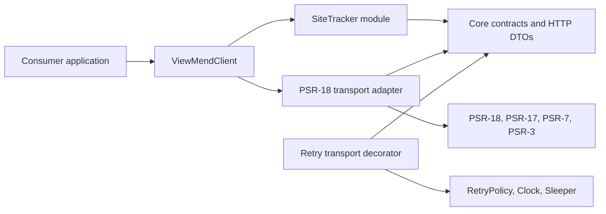

# Architecture

## Status

This document records the initial public architecture of `viewmend/sdk`. A public license has not yet been selected, so Packagist distribution and release tags remain disabled until licensing is finalized.

## Runtime baseline

The minimum runtime is PHP 8.3. According to the [official PHP support matrix](https://www.php.net/supported-versions.php), PHP 8.2 reaches end of security support in December 2026, while PHP 8.3 remains security-supported through December 2027. PHP 8.3 is therefore the practical compatibility floor for a new production SDK without forcing consumers onto the newest runtime. The supported constraint is `>=8.3` so the library can run on later compatible PHP releases.

Every PHP file uses strict types. The source tree uses PSR-4 and PSR-12.

## Scope

The repository is a general ViewMend SDK with a reusable Core. Site Tracker Events is the first implemented product module. Page Audit, Page Promise, and AI Visibility may become independent modules only after their real API contracts exist; no empty classes or speculative abstractions are reserved for them.

Laravel integration will live in `viewmend/laravel` and depend on this package. Laravel and WordPress code are outside this repository.

## Dependency direction



The important constraints are:

- Core contracts and generic DTOs know nothing about Site Tracker.
- Site Tracker depends inward on the transport contract; it does not know the concrete PSR-18 client.
- Infrastructure implements the transport contract and owns PSR message construction, authentication injection, and transport-exception sanitization.
- Retry is a transport decorator. The module explicitly marks an event request safe to repeat because the server deduplicates it by `event_id`.

## Packages and responsibilities

- `Core/Config`: validated base URL, integration identifier, and an opaque API token value.
- `Contracts/Http`: the internal transport seam used by modules.
- `Core/Http`: generic immutable request/response DTOs, the PSR-18 adapter, and retry decorator.
- `Core/Retry`: retry policy, clock, and sleeper strategies. The default policy retries network failures, 429, and transient 500/502/503/504 responses only.
- `Core/Exception`: stable SDK exception hierarchy and HTTP error mapping.
- `SiteTracker/Event`: immutable event DTOs, event types, URL/event-id value objects, and an optional builder.
- `SiteTracker/Response`: typed delivery result and forward-compatible queue status value object.
- `SiteTracker/EventsClient`: serializes the v1 event contract and maps responses.
- `SiteTracker/SiteTrackerClient`: module entry point exposed by `ViewMendClient`.

## Public construction and API

The package intentionally does not discover or instantiate a concrete HTTP client. A consumer supplies a PSR-18 client and PSR-17 request and stream factories:

```php
$client = ViewMendClient::create(
    config: new SdkConfig(
        apiBaseUrl: 'https://app.viewmend.com',
        apiToken: 'vmt_secret',
        integration: 'integration-id',
    ),
    httpClient: $httpClient,
    requestFactory: $requestFactory,
    streamFactory: $streamFactory,
);

$result = $client->siteTracker()->events()->send($event);
```

`ViewMendClient` is an ordinary object facade. It has no static global state and resolves no services from a container.

## Site Tracker Events contract

`EventsClient::send()` posts the same JSON body on every retry to:

`/api/v1/site-tracker/integrations/{integration}/events`

The PSR adapter adds `Authorization: Bearer ...`, `Accept: application/json`, and `Content-Type: application/json`. It does not add a timestamp header.

HTTP 202 is a newly accepted event; HTTP 200 is a duplicate delivery. Both produce `DeliveryResult`. The result exposes counts as integers, parses `scheduled_for` as an immutable date-time when present, and retains unknown `queue_status` values through `QueueStatus` rather than rejecting them.

HTTP 401, 410, 413, 422, 429, documented transient 5xx, malformed JSON, and invalid success payloads map to predictable exception types. PSR-18 network failures are distinguished from non-network client/request failures so only the former can be retried. Server response bodies are not copied verbatim into exception messages, which prevents accidental credential or sensitive-payload disclosure.

## Retry semantics

The initial request counts as attempt one. The default policy permits at most three total attempts. It uses bounded exponential delay for network failures and transient 5xx responses. For 429 it honors `Retry-After` in delta-seconds or HTTP-date form, bounded by the configured maximum delay. Tests inject a fake sleeper and clock; production uses the system clock and native sleep.

No automatic retry occurs for 401, 410, 413, 422, malformed success responses, or requests not explicitly marked retry-safe.

## Dependencies

Production dependencies are only the PSR HTTP client/factory/message and logger interfaces. `psr/log` supplies `NullLogger` as the default logger. A concrete PSR-7 implementation is a development dependency used by contract tests and remains the consumer's choice in production.

## Compatibility policy

Known `event_type` values are a closed client input enum because sending an unsupported type is invalid under API v1. Server-returned queue statuses are open-ended and represented by a validated string value object. Stable response objects are returned instead of associative arrays. Future modules must follow the same dependency direction without changing the Site Tracker public path.
