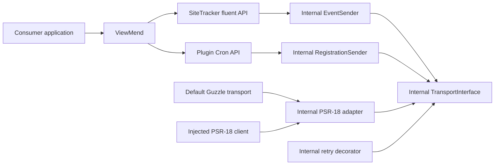

# Architecture

## Status

This document records the architecture of the MIT-licensed `viewmend/sdk` package published through Packagist.

## Runtime baseline

The minimum runtime is PHP 8.3. According to the [official PHP support matrix](https://www.php.net/supported-versions.php), PHP 8.2 reaches end of security support in December 2026, while PHP 8.3 remains security-supported through December 2027. PHP 8.3 is therefore the practical compatibility floor for a new production SDK without forcing consumers onto the newest runtime.

Every PHP file uses strict types. The source tree uses PSR-4 and PSR-12.

## Product scope

The repository is the general ViewMend SDK. Site Tracker Events and Plugin Cron are isolated product modules built on the same transport. Additional modules may be added only for documented API contracts.

Laravel integration will live in `viewmend/laravel` and depend on this package. Laravel and WordPress code are outside this repository.

## Public API

The supported public surface is intentionally small:

- `ViewMend\ViewMend`: default client factory, advanced PSR factory, and module access.
- `ViewMend\SiteTracker\SiteTrackerClient`, `Events`, and `PendingEvent`: fluent Site Tracker event construction.
- `ViewMend\SiteTracker\Response\*`: typed delivery IDs, result, and forward-compatible queue status.
- `ViewMend\PluginCron\PluginCronClient`: schedule registration, inspection, and disabling.
- `ViewMend\PluginCron\CallbackVerifier` and `Callback`: signed callback verification and typed delivery data.
- `ViewMend\PluginCron\Response\RegistrationResult`: typed server registration state.
- `ViewMend\Exception\*`: stable configuration, validation, transport, and API failures.
- PSR-18, PSR-17, and PSR-3 interfaces used by the advanced factory.

Classes below `ViewMend\Internal` are implementation details and are not compatibility promises.

`ViewMend::client()` is a static named constructor, not a static facade or global service locator. It returns an ordinary immutable client instance and stores no global state.

## Dependency direction

Core transport, configuration, validation, and retry behavior know nothing about Site Tracker. The Site Tracker integration ID is validated only at `siteTracker($integrationId)`; creating the general ViewMend client requires only credentials and transport configuration.

Plugin Cron callback verification intentionally sits outside the outbound HTTP transport. It derives the signing secret from the connection key, validates the timestamp and HMAC over the exact raw body, binds the header request ID to the payload run ID, and returns a typed callback. It performs no network I/O.

## Transport construction

`ViewMend::client(token: ...)` creates Guzzle and its PSR-17 factories internally. Guzzle is a production dependency, so consumers do not need to select or configure a transport for the default workflow.

`ViewMend::withPsr18()` accepts any PSR-18 client and PSR-17 request and stream factories for Laravel integration, tests, self-hosted deployments, or applications with managed HTTP infrastructure. Both factories produce the same internal transport stack and behavior. The consumer-facing setup is documented separately in [advanced configuration](advanced-configuration.md) so the main README remains focused on the default workflow.

The default logger is `Psr\Log\NullLogger`.

The default Guzzle client uses a 3-second connection timeout and a 10-second total timeout per attempt. TLS verification remains enabled and redirects are disabled. With at most three attempts and the default exponential backoff, a timeout-only failure is bounded to approximately 31 seconds.

## API URL composition

The canonical versioned API base URL is:

`https://viewmend.com/api/v1`

The Site Tracker module owns only its relative resource path:

`/site-tracker/integrations/{integration}/events`

The resulting production endpoint is:

`https://viewmend.com/api/v1/site-tracker/integrations/{integration}/events`

The Plugin Cron module owns one relative resource path:

`/plugin-cron/registration`

An `apiBaseUrl` override is available for tests, self-hosted installations, and advanced configuration. The version prefix belongs in `apiBaseUrl`; modules must not duplicate `/api/v1`.

## Site Tracker event flow

Semantic methods such as `deployment()`, `contentUpdate()`, and `maintenance()` choose a valid API event type without requiring an enum import. They return an immutable `PendingEvent`. Fluent methods return a new valid pending value; only `send()` performs I/O.

Known changed-field values use semantic methods such as `contentChanged()` and `metadataChanged()` so consumers do not repeat protocol strings. `customFieldChanged()` preserves support for application-specific and future field names without putting Site Tracker constants on the root SDK client.

Internally, the fluent surface creates and evolves a validated immutable `SiteTrackerEvent`. The sender serializes the exact v1 JSON contract and returns a typed `DeliveryResult`, never a public associative array.

HTTP 202 represents a newly accepted event and HTTP 200 a duplicate delivery. Counts remain integers, `scheduled_for` becomes an immutable date-time, and unknown `queue_status` values are preserved by `QueueStatus`.

## Retry and error semantics

The initial request counts as attempt one. The default policy permits at most three total attempts. It retries explicitly safe event requests for PSR-18 network failures, HTTP 429, and transient 500/502/503/504 responses.

`Retry-After` is honored in delta-seconds or HTTP-date form and bounded by the configured maximum delay. The identical serialized request and event ID are reused on every attempt.

No automatic retry occurs for 401, 410, 413, 422, non-network PSR request failures, malformed success responses, or requests not marked retry-safe.

Plugin Cron registration operations are idempotent and marked retry-safe. Runtime callbacks are delivered by ViewMend with at-least-once semantics; plugins must deduplicate by the stable callback run ID.

Server response bodies and authorization data are not copied into exception messages or log context. API tokens are redacted from debug and export output.

## Dependencies

Production dependencies are Guzzle plus the PSR HTTP client, factory, message, and logger interfaces. Guzzle supplies the ready-to-use default client and PSR-17 implementation. The PSR interfaces remain direct dependencies because they are part of the advanced extension API.

Development dependencies provide PHPUnit, PHPStan, PSR-12 checks, and an independent PSR-7 implementation for contract tests.
